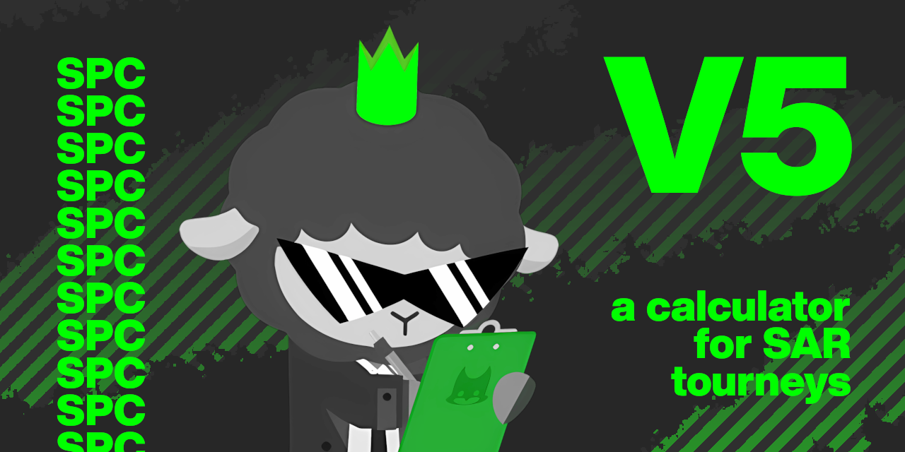

# Super Python Calculator

A complete calculator for scoring tournament for Super Animal Royale. It supports solo, duo and squads, offer the possibilitie to export leaderboards and its highly customizable !

## Want to run the code ?

All the instruction have been moved to the [Wiki](https://github.com/MoutonBinoclard/Super-Python-Calculator/wiki). Please check it out for the installation and usage of the script.

## Features

The project is still being developped, but here are what the script can do so far :

- No limits for the numbers of games and let the games be added or removed with ease
- Autodectection of the players throughout an entire event
- Option to ban player while adjusting the placement
- Tools to easely create teams and not struggle with PlayfabID
- Supporting scoring preset depending on the number of players, placement and kills
- Customization of the colors and the font of exported graphics
- Web server to display the leaderboard in real time (beta)

You can always ask new feature of course (Don't know if I'll code them tho)
