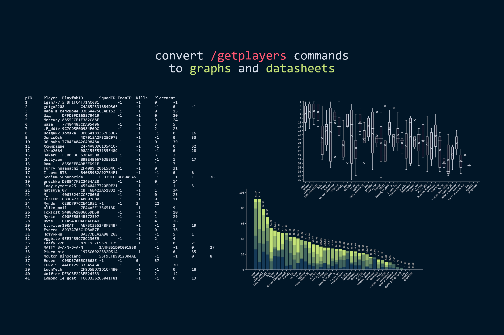
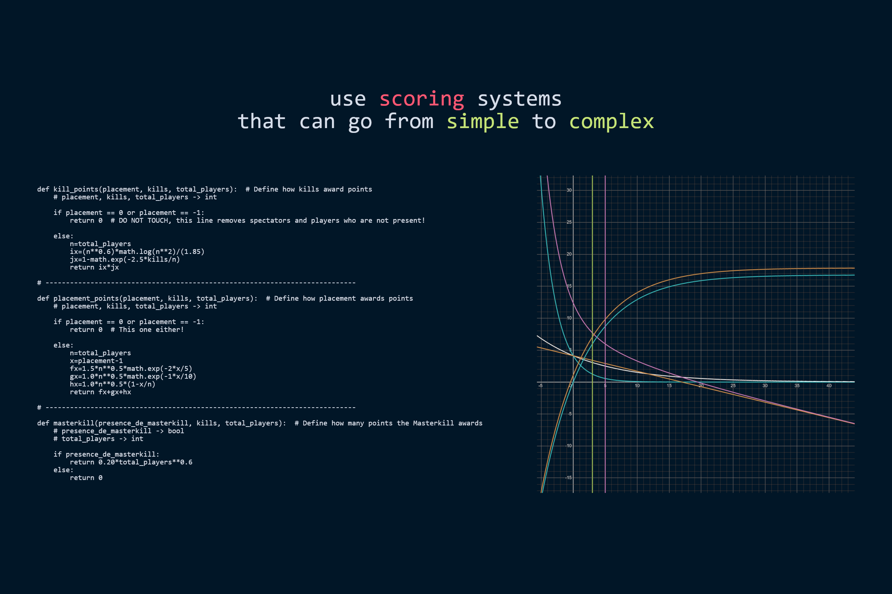
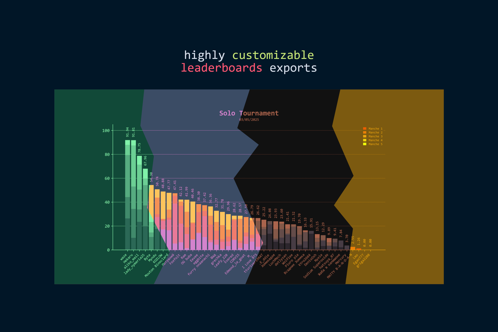

# Super Python Calculator

A complete calculator for scoring tournament for Super Animal Royale. It supports solo, duo and squads, offer the possibilitie to export leaderboards and its highly customizable !

## Want to run the code ?

All the instruction have been moved to the [Wiki](https://github.com/MoutonBinoclard/Super-Python-Calculator/wiki). Please check it out for the installation and usage of the script.

## What's all the code about ?

### Convert /getplayers commands to graphs and datasheets
- No limits for the numbers of games and let the games be added or removed with ease
- Autodectection of the players throughout an entire event
- Option to ban player while adjusting the placement
- Tools to easely create teams and not struggle with PlayfabID

---

### Scoring systems ? I think the sky is the limit !
- Supporting scoring preset that can be saved and loaded
- Placement and kill points can depend on the numuber of players
- Support for the masterkill
- Mathematical functions like exponential, floor, log... are supported

---

- Colors are fully customizable for each element
- Color presets can be saved, shared and loaded
- Custom font are suupported (ttf and otf) (with some bugs tho)

---

- Web server to display the leaderboard in real time (beta)

You can always ask new feature of course (Don't know if I'll code them tho)
