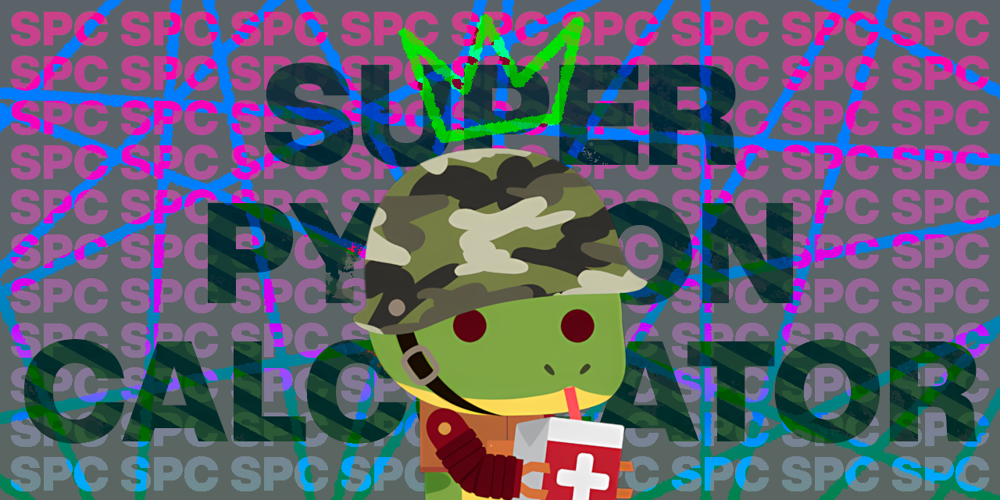
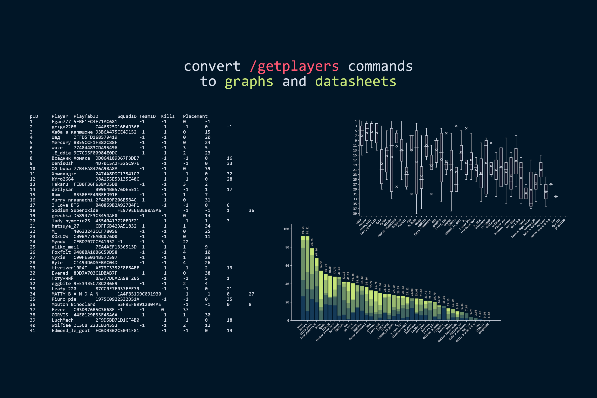
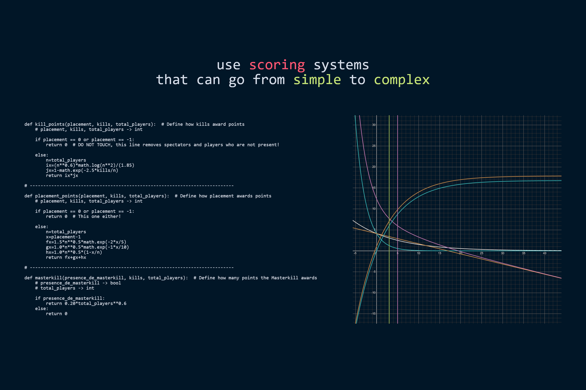
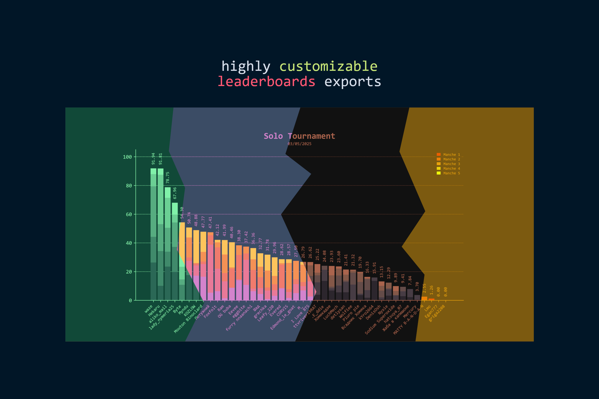
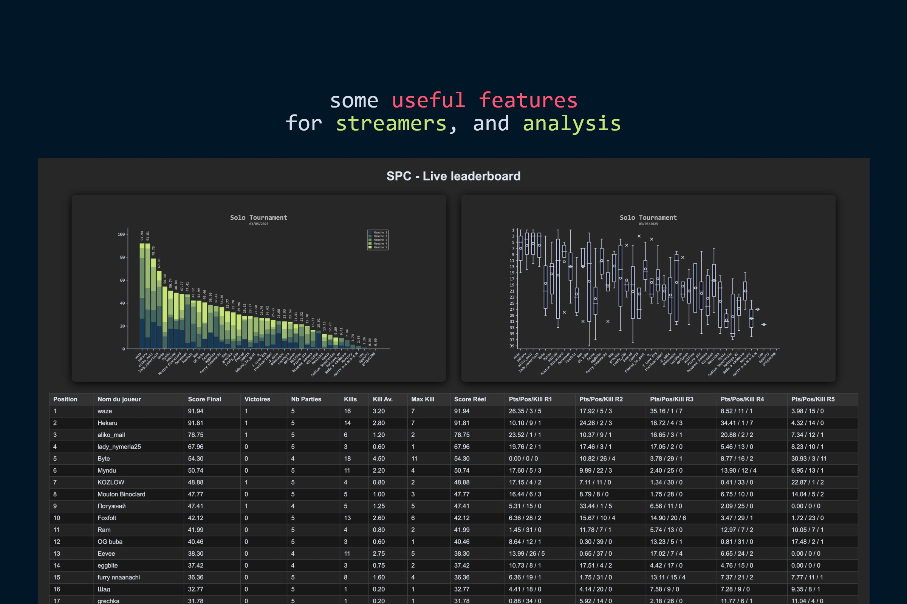

# Super Python Calculator

A complete calculator for scoring tournament for Super Animal Royale. It supports solo, duo and squads, offer the possibilitie to export leaderboards and its highly customizable !

Oh and before I forget, this code is not meant to manage the settings and the commands in a private game. If you want to do so, I'll recommend you to check Suchy's [Private Game Helper](https://github.com/Suchy499/PrivateGameHelper-for-Super-Animal-Royale)

    <a href="https://github.com/MoutonBinoclard/Super-Python-Calculator/releases/latest">
        <strong>🔥 Download the latest release here 🔥</strong>
    </a>

## Video tutorial, how to install and use the SPC (English subtitles available) (Just click the picture below)

## Want to run the code ?

All the instruction have been moved to the [Wiki](https://github.com/MoutonBinoclard/Super-Python-Calculator/wiki). Please check it out for the installation and usage of the script.

## What's all the code about ?

### Convert /getplayers commands to graphs and datasheets
- No limits for the numbers of games and let the games be added or removed with ease
- Autodectection of the players throughout an entire event
- Option to ban player while adjusting the placement
- Tools to easely create teams and not struggle with PlayfabID

---

### Scoring systems ? I think the sky is the limit !
- Supporting scoring preset that can be saved and loaded
- Placement and kill points can depend on the numuber of players
- Support for the masterkill
- Mathematical functions like exponential, floor, log... are supported

---

### Colors, yeeeaaaaah !
- Colors are fully customizable for each element
- Color presets can be saved, shared and loaded
- Custom font are supported (ttf and otf) (with some bugs tho)
- Custom logo can be added
- Date can be shown

---

### And don't forget the perks for streamers and players
- Web server to display the leaderboard in real time
- Export simple leaderboard to quickly send or show on a stream
- Full leaderboard that can be pasted in libre office calc or excel
- Python : Fully customizable if you know how to code haha !
- Autohotkey script to save round and launch games

---

### And before I forget
You can always ask new feature of course (Don't know if I'll code them tho). Also if you want to improve the code, feel free to create a pull request. I will be happy to merge it if it is well coded and documented !

### Some commands for me :
pyinstaller --onefile --windowed settings_editor.py
pyinstaller --onefile --windowed SPC_scoring_creator.py
pyinstaller --onefile SPC.py
pyinstaller --onefile --windowed --icon=spc_se.ico settings_editor.py
pyinstaller --onefile --windowed --icon=spc_sc.ico SPC_scoring_creator.py
